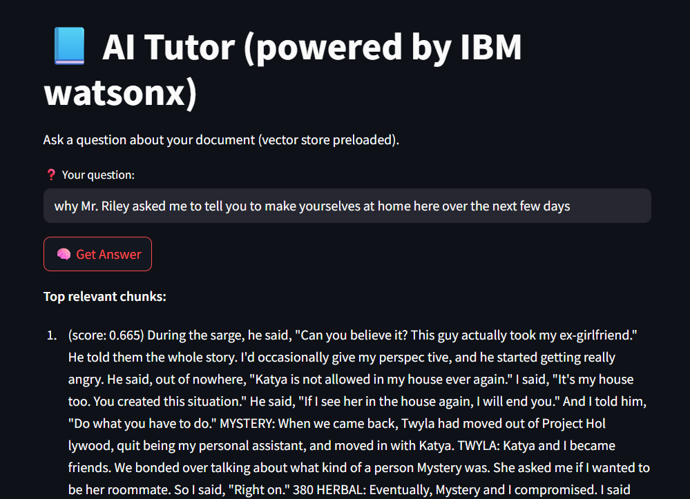

# Watsonx.ai – Simple RAG Documents

Hello everyone, this is a simple demo to explain how it works RAG.

##  Overview

This project is a Retrieval-Augmented Generation (RAG) chatbot tutor that helps students ask questions from their own study materials (like PDFs).

It uses:
-  IBM's `slate-30m-english-rtrvr` model to generate embeddings
-  IBM's `granite-13b-instruct-v2` LLM to generate answers
-  A clean 3-step modular pipeline using Python and IBM watsonx.ai API
-  Optional Streamlit frontend for future file uploads


##  Features

- Chunk PDF content into semantically relevant pieces
- Generate vector embeddings using IBM's API
- Perform vector similarity search using cosine similarity
- Feed top chunks to IBM’s LLM to generate high-quality answers
- CLI-based chatbot loop + basic frontend prototype


##  Project Structure
```bash
├── app.py # Basic Streamlit frontend
├── ibm_auth.py # Gets access token using IBM API key
├── step1_extract_chunks.py # PDF chunking script
├── step2_generate_embeddings_ibm.py # Embedding generator
├── step3_vector_search.py # Combines search and LLM answering
├── store_embeddings.py # Saves embeddings to JSON
├── vector_search.py # Cosine similarity search logic
├── vector_store.json # Stored chunks + embeddings
├── sample.pdf # sample file used for testing
├── requirements.txt # Dependencies list
├── README.md # This file
```

## Quick Start

###  Clone the repository
```bash
git clone https://github.com/ruslanmv/Watsonx-Simple-RAG-Documents
cd Watsonx-Simple-RAG-Documents
```
##  How to Run the Project

### 1. Chunk a PDF

```bash
python step1_extract_chunks.py
```
### 2. Generate Embeddings using IBM

```bash
python step2_generate_embeddings_ibm.py
```
### 3. Ask Questions (CLI)

```bash
python step3_vector_search.py
```
### 4. Run Frontend

```bash
streamlit run app.py
```

